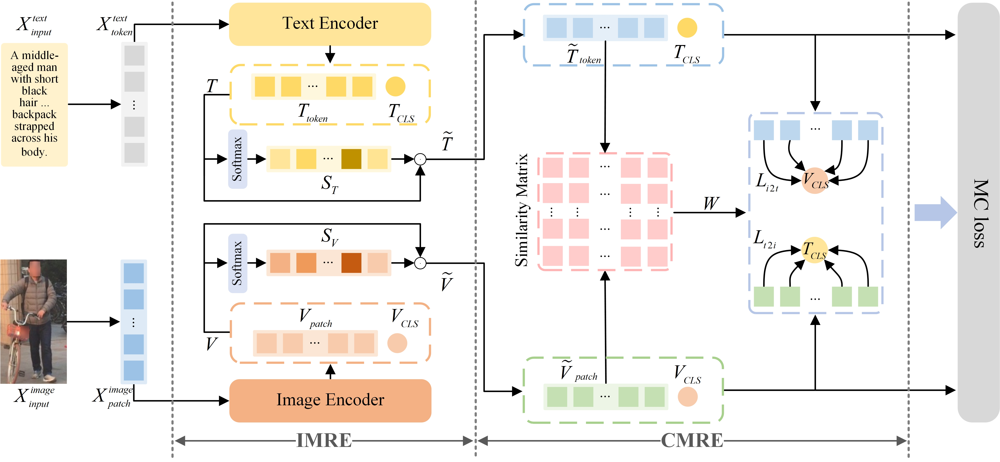
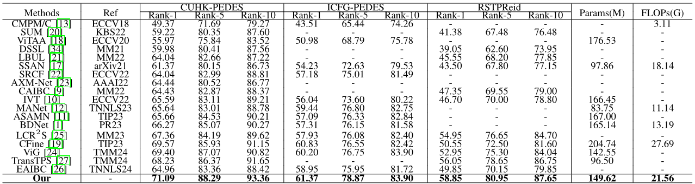

# Text-Based Person Retrieval via Cross-Modality Redundant Perception

$^{1}$Shuai You, $^{1}$Yujian Feng, $^{2}$Cuiqun Chen, $^{1}$Fei Wu, $^{1}$ Yimu Ji, and $^{2}$Xiao-Yuan Jing

$^{1}$ Nanjing University of Posts and Telecommunications

$^{2}$ Wuhan University




## Usage
### Requirements
we use single RTX3090 24G GPU for training and evaluation. 
```
pytorch 1.9.0
torchvision 0.10.0
prettytable
easydict
```

### Prepare Datasets
Download the CUHK-PEDES dataset from [here](https://github.com/ShuangLI59/Person-Search-with-Natural-Language-Description), ICFG-PEDES dataset from [here](https://github.com/zifyloo/SSAN) and RSTPReid dataset form [here](https://github.com/NjtechCVLab/RSTPReid-Dataset)

Organize them in `your dataset root dir` folder as follows:
```
|-- your dataset root dir/
|   |-- <CUHK-PEDES>/
|       |-- imgs
|            |-- cam_a
|            |-- cam_b
|            |-- ...
|       |-- reid_raw.json
|
|   |-- <ICFG-PEDES>/
|       |-- imgs
|            |-- test
|            |-- train 
|       |-- ICFG_PEDES.json
|
|   |-- <RSTPReid>/
|       |-- imgs
|       |-- data_captions.json
```

## Training
```python
The training script will be made publicly available after the paper is accepted.
```
## Testing

```python
python test.py
```
#### Comparison with other methods on three datasets (CUHK-PEDES, ICFG-PEDES, and RSTPReid). Rank-1, Rank-5, and Rank-10 represent the accuracy (%), with higher values indicating better performance.



[Model & log for CUHK-PEDES](https://drive.google.com/file/d/1OBhFhpZpltRMZ88K6ceNUv4vZgevsFCW/view?usp=share_link)

[Model & log for ICFG-PEDES](https://drive.google.com/file/d/1Y3D7zZsKPpuEHWJ9nVecUW-HaKdjDI9g/view?usp=share_link)

[Model & log for RSTPReid](https://drive.google.com/file/d/1LpUHkLErEWkJiXyWYxWwiK-8Fz1_1QGY/view?usp=share_link)


## Acknowledgments
Some components of this code implementation are adopted from [CLIP](https://github.com/openai/CLIP), [IRRA](https://github.com/BrandonHanx/TextReID) and [TransReID](https://github.com/damo-cv/TransReID). We sincerely appreciate for their contributions.

